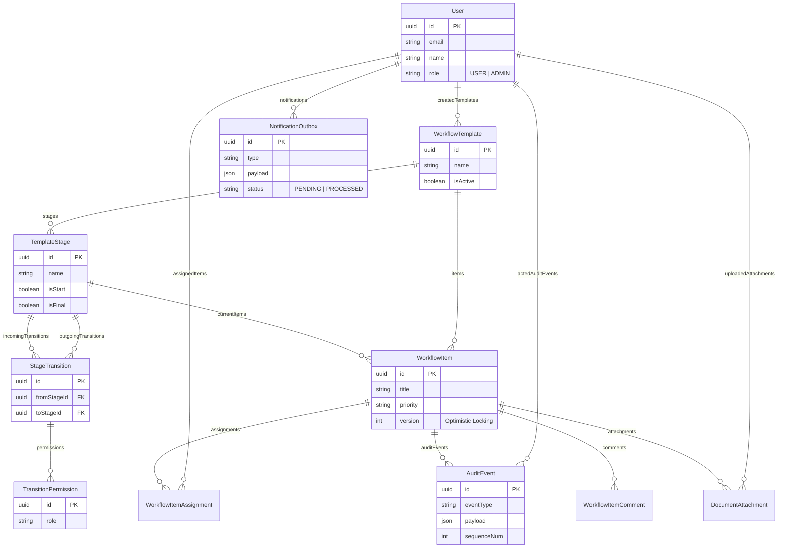

# WorkflowCore: Configurable Workflow Engine

WorkflowCore is a highly scalable, robust workflow engine designed to manage dynamic business processes. It supports customizable workflows, data-driven permissions, concurrency-safe transitions and field edits, event sourcing (immutable audit trails), and durable notifications.

## 🏗 Architecture & Key Design Decisions

The architecture was specifically designed to handle high concurrency, data integrity, and complex business logic cleanly.

### 1. Concurrency Safety (Transitions & Field Edits)
- **Problem**: Concurrent users could overwrite each other's edits or create bifurcated workflow states.
- **Solution**: The engine employs a hybrid locking strategy. 
  - **Field Edits**: We use **Optimistic Locking** combined with pessimistic row locks. The client must submit the current `version` of the item. During the update, the backend acquires a `SELECT ... FOR UPDATE` lock, verifies the version, applies the update, and increments the version atomically. This ensures exactly one winner without silently dropping edits.
  - **Stage Transitions**: Transitions also utilize `SELECT ... FOR UPDATE` within a Prisma transaction to ensure that two users attempting to transition the same item simultaneously are serialized, and only the valid transition succeeds.

### 2. Immutable Audit Trail (Event Sourcing)
- **Problem**: Audit logs are often treated as "side-tables" that drift from the materialized state over time.
- **Solution**: The engine is built around Event Sourcing principles. Every state change (creation, transition, comment) is recorded as an immutable `AuditEvent`. The `ReconcileService` provides an endpoint that can provably rebuild the materialized state of any item completely from scratch by replaying its event history forward. 

### 3. Durable Notification Queue (Transactional Outbox Pattern)
- **Problem**: In-memory queues lose messages if the server crashes. Standard external message queues can suffer from dual-write problems if the database transaction commits but the message fails to send.
- **Solution**: We implemented the **Transactional Outbox Pattern**. Notifications are written to a `NotificationOutbox` table in the PostgreSQL database within the exact same database transaction as the business logic. A separate background cron worker consumes this outbox, ensuring guaranteed at-least-once delivery even in the event of mid-transaction crashes.

### 4. Data-Driven Permissions
- **Problem**: Workflow permissions are often hardcoded into scattered `if` statements.
- **Solution**: Permissions are treated entirely as configuration. The `TransitionPermission` table maps required roles to specific `StageTransitions`. The generic `TransitionPolicyService` evaluates the workflow graph dynamically at runtime, allowing administrators to define entirely new workflows and permission structures without deploying new code.

---

## 🛠 Setup Instructions

### Prerequisites
- Node.js v18+
- Docker and Docker Compose (for PostgreSQL and Redis)
- npm or yarn

### 1. Infrastructure Setup
Start the PostgreSQL database and Redis using Docker Compose:
```bash
docker-compose up -d
```

### 2. Backend Setup
Navigate to the `backend` directory, install dependencies, and run database migrations:
```bash
cd backend
npm install
npm run migrate    # Applies Prisma migrations to the DB
npm run start:dev  # Starts the NestJS API server on http://localhost:3000
```

### 3. Frontend Setup (Optional for UI testing)
Navigate to the `frontend` directory:
```bash
cd frontend
npm install
npm run dev        # Starts the Next.js frontend on http://localhost:3001
```

---

## 🧪 Automated Test Suite

A comprehensive end-to-end test suite is included to prove the system's safety under concurrent load and adversarial conditions.

To run the test suite:
```bash
cd backend
npm run test:e2e
```

**Key Tests Included:**
- `concurrency-field-edits.e2e-spec.ts`: Proves optimistic locking by firing concurrent `Promise.all` requests and verifying exactly one 200 OK and one 409 Conflict.
- `concurrency-transitions.e2e-spec.ts`: Proves transition safety under concurrent stress.
- `audit-event-sourcing.e2e-spec.ts`: Verifies the audit log captures all actions.
- `crash-recovery.e2e-spec.ts`: Proves the `ReconcileService` can accurately rebuild the state from the audit log.
- `notification-queue.e2e-spec.ts`: Validates the outbox queue mechanism.

---

## 📖 API Documentation

The backend utilizes **Swagger** for interactive API documentation. 
Once the backend server is running (`npm run start:dev`), you can view and test all endpoints via the Swagger UI at:
**[http://localhost:3000/api-docs](http://localhost:3000/api-docs)**

---

## 📊 Database Schema (ER Diagram)

Below is the Mermaid Entity-Relationship diagram illustrating our data model.


