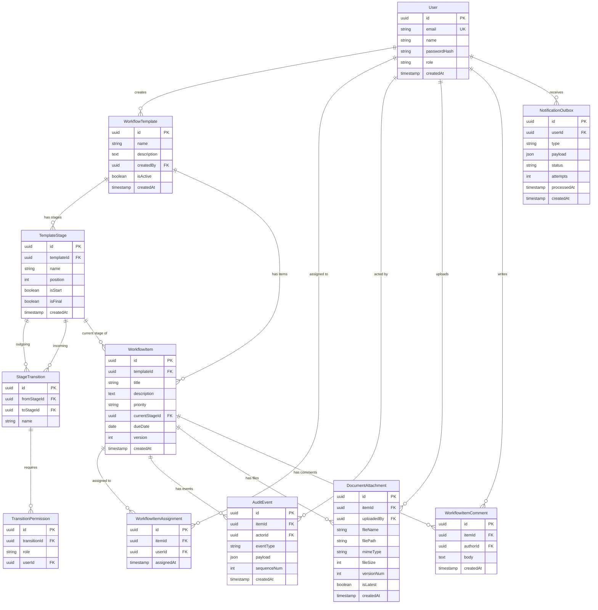

# Guide 02 — Database Schema

> **What you'll build in this guide:** The complete Prisma schema for WorkflowCore — workflow templates with arbitrary graph transitions, workflow items with event-sourced state, notification outbox, document attachments with versioning, and all indexes/constraints needed for correctness and performance.

---

## 1. Design Rationale

### 1.1 Why Event Sourcing?

The assessment explicitly requires:
> *"The complete current state of any item must be reconstructable entirely by replaying its event history."*

This is the same pattern you used in Task 1 with `ledger_entries` — an append-only audit log that doubles as the source of truth. Here we take it further:

| Concept | Task 1 (Ledger) | Task 2 (Audit Events) |
|---------|-----------------|----------------------|
| Source of truth | `ledger_entries` | `audit_events` |
| Cached/derived state | `orders.status` | `workflow_items.currentStageId`, etc. |
| Rebuilds from log | Replay ledger to reconstruct order state | Replay events to reconstruct item state |

### 1.2 Template-Driven Permissions

The assessment evaluators specifically check:
> *"Do they treat permissions as configuration (data-driven per template) or as scattered if statements?"*

Our schema stores transition permissions **in the database as template configuration**, not as hardcoded role checks in the code.

### 1.3 Optimistic Concurrency

Every mutable entity gets a `version` column. This continues the pattern from your Task 1 `orders.version` field.

---

## 2. Complete Prisma Schema

Create or replace `backend/prisma/schema.prisma`:

```prisma
// prisma/schema.prisma

generator client {
  provider = "prisma-client-js"
}

datasource db {
  provider = "postgresql"
  url      = env("DATABASE_URL")
}

// ============================================================
// USERS
// ============================================================

model User {
  id           String   @id @default(uuid()) @db.Uuid
  email        String   @unique
  name         String
  passwordHash String   @map("password_hash")
  role         String   @default("USER") // USER | ADMIN
  createdAt    DateTime @default(now()) @map("created_at")

  // Relations
  createdTemplates     WorkflowTemplate[]
  assignedItems        WorkflowItemAssignment[]
  actedAuditEvents     AuditEvent[]             @relation("actor")
  uploadedAttachments  DocumentAttachment[]
  comments             WorkflowItemComment[]
  notifications        NotificationOutbox[]

  @@map("users")
}

// ============================================================
// WORKFLOW TEMPLATES — the configurable workflow definitions
// ============================================================

// A workflow template defines the "shape" of a workflow:
// what stages exist, which transitions are valid, and who can perform them.
model WorkflowTemplate {
  id          String   @id @default(uuid()) @db.Uuid
  name        String
  description String?  @db.Text
  createdBy   String   @map("created_by") @db.Uuid
  isActive    Boolean  @default(true) @map("is_active")
  createdAt   DateTime @default(now()) @map("created_at")
  updatedAt   DateTime @updatedAt @map("updated_at")

  // Relations
  creator User            @relation(fields: [createdBy], references: [id])
  stages  TemplateStage[]
  items   WorkflowItem[]

  @@map("workflow_templates")
}

// A named stage within a template (e.g., "Draft", "Review", "Approved").
// Stages form the nodes of the workflow graph.
model TemplateStage {
  id         String   @id @default(uuid()) @db.Uuid
  templateId String   @map("template_id") @db.Uuid
  name       String
  position   Int      @default(0) // for UI ordering
  isStart    Boolean  @default(false) @map("is_start") // can items start here?
  isFinal    Boolean  @default(false) @map("is_final") // is this a terminal stage?
  createdAt  DateTime @default(now()) @map("created_at")

  // Relations
  template          WorkflowTemplate     @relation(fields: [templateId], references: [id], onDelete: Cascade)
  outgoingTransitions StageTransition[]   @relation("fromStage")
  incomingTransitions StageTransition[]   @relation("toStage")
  currentItems      WorkflowItem[]       @relation("currentStage")

  @@unique([templateId, name]) // Stage names must be unique within a template
  @@map("template_stages")
}

// A valid transition between two stages — the edges of the workflow graph.
// This is what makes it an "arbitrary graph, not assumed linear."
model StageTransition {
  id          String   @id @default(uuid()) @db.Uuid
  templateId  String   @map("template_id") @db.Uuid
  fromStageId String   @map("from_stage_id") @db.Uuid
  toStageId   String   @map("to_stage_id") @db.Uuid
  name        String?  // optional label, e.g. "Approve", "Reject", "Send Back"
  createdAt   DateTime @default(now()) @map("created_at")

  // Relations
  fromStage   TemplateStage          @relation("fromStage", fields: [fromStageId], references: [id], onDelete: Cascade)
  toStage     TemplateStage          @relation("toStage", fields: [toStageId], references: [id], onDelete: Cascade)
  permissions TransitionPermission[]

  @@unique([fromStageId, toStageId]) // Only one transition between any two stages
  @@map("stage_transitions")
}

// Who is allowed to perform a specific transition.
// Permissions are DATA-DRIVEN — stored per template, not hardcoded.
model TransitionPermission {
  id           String  @id @default(uuid()) @db.Uuid
  transitionId String  @map("transition_id") @db.Uuid
  role         String? // e.g. "ADMIN", "USER" — null means check userId instead
  userId       String? @map("user_id") @db.Uuid // specific user — null means check role

  // Relations
  transition StageTransition @relation(fields: [transitionId], references: [id], onDelete: Cascade)

  @@map("transition_permissions")
}

// ============================================================
// WORKFLOW ITEMS — instances of a template
// ============================================================

// A workflow item is a single "thing" moving through the workflow.
// Its `currentStageId` is MATERIALIZED/CACHED state derived from audit events.
model WorkflowItem {
  id             String   @id @default(uuid()) @db.Uuid
  templateId     String   @map("template_id") @db.Uuid
  title          String
  description    String?  @db.Text
  priority       String   @default("MEDIUM") // LOW | MEDIUM | HIGH | URGENT
  currentStageId String   @map("current_stage_id") @db.Uuid
  dueDate        DateTime? @map("due_date")
  version        Int      @default(1) // Optimistic concurrency lock
  createdAt      DateTime @default(now()) @map("created_at")
  updatedAt      DateTime @updatedAt @map("updated_at")

  // Relations
  template     WorkflowTemplate        @relation(fields: [templateId], references: [id])
  currentStage TemplateStage           @relation("currentStage", fields: [currentStageId], references: [id])
  assignments  WorkflowItemAssignment[]
  auditEvents  AuditEvent[]
  attachments  DocumentAttachment[]
  comments     WorkflowItemComment[]

  @@index([templateId])
  @@index([currentStageId])
  @@index([createdAt])
  @@map("workflow_items")
}

// Many-to-many: a workflow item can be assigned to multiple users.
model WorkflowItemAssignment {
  id         String   @id @default(uuid()) @db.Uuid
  itemId     String   @map("item_id") @db.Uuid
  userId     String   @map("user_id") @db.Uuid
  assignedAt DateTime @default(now()) @map("assigned_at")

  // Relations
  item WorkflowItem @relation(fields: [itemId], references: [id], onDelete: Cascade)
  user User         @relation(fields: [userId], references: [id])

  @@unique([itemId, userId]) // Can't assign same user twice
  @@map("workflow_item_assignments")
}

// ============================================================
// AUDIT EVENTS — the immutable source of truth (event sourcing)
// ============================================================

// Every operation on a workflow item generates an immutable audit event.
// The current state can be reconstructed entirely by replaying these events.
// This table is APPEND-ONLY — no updates, no deletes.
model AuditEvent {
  id          String   @id @default(uuid()) @db.Uuid
  itemId      String   @map("item_id") @db.Uuid
  actorId     String   @map("actor_id") @db.Uuid
  eventType   String   @map("event_type")
  // Event types:
  //   ITEM_CREATED
  //   STAGE_TRANSITION
  //   FIELD_UPDATED
  //   ASSIGNMENT_ADDED
  //   ASSIGNMENT_REMOVED
  //   COMMENT_ADDED
  //   ATTACHMENT_ADDED
  //   ATTACHMENT_REMOVED

  // The full event payload — contains all data needed to reconstruct state.
  // For STAGE_TRANSITION: { fromStageId, toStageId, fromStageName, toStageName }
  // For FIELD_UPDATED: { field, oldValue, newValue }
  // For ASSIGNMENT_ADDED: { userId, userName }
  // etc.
  payload     Json     @default("{}")
  
  // Sequence number per item — used for ordering during replay
  sequenceNum Int      @map("sequence_num")
  
  createdAt   DateTime @default(now()) @map("created_at")
  // NOTE: No updatedAt — this table is append-only

  // Relations
  item  WorkflowItem @relation(fields: [itemId], references: [id])
  actor User         @relation("actor", fields: [actorId], references: [id])

  @@index([itemId, sequenceNum]) // Fast event replay per item
  @@index([itemId, createdAt])   // Time-based queries
  @@index([actorId])
  @@map("audit_events")
}

// ============================================================
// COMMENTS
// ============================================================

model WorkflowItemComment {
  id        String   @id @default(uuid()) @db.Uuid
  itemId    String   @map("item_id") @db.Uuid
  authorId  String   @map("author_id") @db.Uuid
  body      String   @db.Text
  createdAt DateTime @default(now()) @map("created_at")
  // Comments are immutable once created (no editing, no deleting)

  // Relations
  item   WorkflowItem @relation(fields: [itemId], references: [id], onDelete: Cascade)
  author User         @relation(fields: [authorId], references: [id])

  @@index([itemId, createdAt])
  @@map("workflow_item_comments")
}

// ============================================================
// DOCUMENT ATTACHMENTS (with versioning)
// ============================================================

// Re-uploading creates a new version, never silently overwrites.
model DocumentAttachment {
  id           String   @id @default(uuid()) @db.Uuid
  itemId       String   @map("item_id") @db.Uuid
  uploadedBy   String   @map("uploaded_by") @db.Uuid
  fileName     String   @map("file_name")
  filePath     String   @map("file_path") // path on disk or S3 key
  mimeType     String   @map("mime_type")
  fileSize     Int      @map("file_size") // bytes
  versionNum   Int      @default(1) @map("version_num")
  // All versions of the same logical file share the same originalName.
  // versionNum increments on re-upload.
  isLatest     Boolean  @default(true) @map("is_latest")
  createdAt    DateTime @default(now()) @map("created_at")

  // Relations
  item       WorkflowItem @relation(fields: [itemId], references: [id], onDelete: Cascade)
  uploader   User         @relation(fields: [uploadedBy], references: [id])

  @@index([itemId, fileName, versionNum])
  @@index([itemId, isLatest])
  @@map("document_attachments")
}

// ============================================================
// NOTIFICATION OUTBOX — persistent queue
// ============================================================

// Notifications are queued for later processing, not delivered inline.
// A separate processor consumes this queue.
// Survives crashes — no notifications are ever lost.
model NotificationOutbox {
  id          String    @id @default(uuid()) @db.Uuid
  userId      String    @map("user_id") @db.Uuid
  type        String    // e.g. "STAGE_TRANSITION", "ASSIGNMENT", "COMMENT"
  payload     Json      @default("{}")
  status      String    @default("PENDING") // PENDING | PROCESSING | DELIVERED | FAILED
  attempts    Int       @default(0)
  processedAt DateTime? @map("processed_at")
  createdAt   DateTime  @default(now()) @map("created_at")

  // Relations
  user User @relation(fields: [userId], references: [id])

  @@index([status, createdAt]) // Processor queries pending notifications ordered by time
  @@map("notification_outbox")
}
```

---

## 3. ER Diagram



---

## 4. Run the Migration

```bash
cd backend
npx prisma migrate dev --name init
```

This will:
1. Generate the SQL migration from the schema
2. Apply it to your PostgreSQL database
3. Generate the Prisma Client TypeScript types

### Verify with Prisma Studio:

```bash
npx prisma studio
```

This opens a browser-based GUI where you can inspect all tables and relationships.

---

## 5. Seed Data (Optional but Recommended for Development)

Create `backend/prisma/seed.ts`:

```typescript
// prisma/seed.ts
import { PrismaClient } from '@prisma/client';
import * as bcrypt from 'bcrypt';

const prisma = new PrismaClient();

async function main() {
  // Create users
  const adminHash = await bcrypt.hash('admin123', 12);
  const userHash = await bcrypt.hash('user123', 12);

  const admin = await prisma.user.upsert({
    where: { email: 'admin@workflowcore.dev' },
    update: {},
    create: {
      email: 'admin@workflowcore.dev',
      name: 'Admin User',
      passwordHash: adminHash,
      role: 'ADMIN',
    },
  });

  const alice = await prisma.user.upsert({
    where: { email: 'alice@workflowcore.dev' },
    update: {},
    create: {
      email: 'alice@workflowcore.dev',
      name: 'Alice (Reviewer)',
      passwordHash: userHash,
      role: 'USER',
    },
  });

  const bob = await prisma.user.upsert({
    where: { email: 'bob@workflowcore.dev' },
    update: {},
    create: {
      email: 'bob@workflowcore.dev',
      name: 'Bob (Submitter)',
      passwordHash: userHash,
      role: 'USER',
    },
  });

  // Create a sample workflow template: "Document Approval"
  const template = await prisma.workflowTemplate.create({
    data: {
      name: 'Document Approval',
      description: 'A standard document approval workflow: Draft → Review → Approval → Completed',
      createdBy: admin.id,
      stages: {
        create: [
          { name: 'Draft', position: 0, isStart: true, isFinal: false },
          { name: 'Review', position: 1, isStart: false, isFinal: false },
          { name: 'Approval', position: 2, isStart: false, isFinal: false },
          { name: 'Completed', position: 3, isStart: false, isFinal: true },
          { name: 'Rejected', position: 4, isStart: false, isFinal: true },
        ],
      },
    },
    include: { stages: true },
  });

  const stages = template.stages.reduce(
    (acc, s) => ({ ...acc, [s.name]: s }),
    {} as Record<string, (typeof template.stages)[0]>,
  );

  // Create transitions (arbitrary graph — not linear!)
  // Draft → Review
  // Review → Approval
  // Review → Rejected  (reviewer can reject)
  // Approval → Completed
  // Approval → Review   (send back for revisions — this makes it non-linear)
  // Approval → Rejected

  const transitions = await Promise.all([
    prisma.stageTransition.create({
      data: {
        templateId: template.id,
        fromStageId: stages['Draft'].id,
        toStageId: stages['Review'].id,
        name: 'Submit for Review',
      },
    }),
    prisma.stageTransition.create({
      data: {
        templateId: template.id,
        fromStageId: stages['Review'].id,
        toStageId: stages['Approval'].id,
        name: 'Approve for Final Review',
      },
    }),
    prisma.stageTransition.create({
      data: {
        templateId: template.id,
        fromStageId: stages['Review'].id,
        toStageId: stages['Rejected'].id,
        name: 'Reject',
      },
    }),
    prisma.stageTransition.create({
      data: {
        templateId: template.id,
        fromStageId: stages['Approval'].id,
        toStageId: stages['Completed'].id,
        name: 'Final Approve',
      },
    }),
    prisma.stageTransition.create({
      data: {
        templateId: template.id,
        fromStageId: stages['Approval'].id,
        toStageId: stages['Review'].id,
        name: 'Send Back for Revisions',
      },
    }),
    prisma.stageTransition.create({
      data: {
        templateId: template.id,
        fromStageId: stages['Approval'].id,
        toStageId: stages['Rejected'].id,
        name: 'Reject',
      },
    }),
  ]);

  // Add permissions — data-driven, not hardcoded
  // "Submit for Review" — any USER can do this
  await prisma.transitionPermission.create({
    data: { transitionId: transitions[0].id, role: 'USER' },
  });

  // "Approve for Final Review" — only ADMIN
  await prisma.transitionPermission.create({
    data: { transitionId: transitions[1].id, role: 'ADMIN' },
  });

  // "Reject" from Review — only ADMIN
  await prisma.transitionPermission.create({
    data: { transitionId: transitions[2].id, role: 'ADMIN' },
  });

  // "Final Approve" — only ADMIN
  await prisma.transitionPermission.create({
    data: { transitionId: transitions[3].id, role: 'ADMIN' },
  });

  // "Send Back for Revisions" — only ADMIN
  await prisma.transitionPermission.create({
    data: { transitionId: transitions[4].id, role: 'ADMIN' },
  });

  // "Reject" from Approval — only ADMIN
  await prisma.transitionPermission.create({
    data: { transitionId: transitions[5].id, role: 'ADMIN' },
  });

  console.log('✅ Seed data created successfully');
  console.log(`   Admin: admin@workflowcore.dev / admin123`);
  console.log(`   Alice: alice@workflowcore.dev / user123`);
  console.log(`   Bob:   bob@workflowcore.dev / user123`);
  console.log(`   Template: "${template.name}" with ${template.stages.length} stages and ${transitions.length} transitions`);
}

main()
  .catch((e) => {
    console.error('Seed error:', e);
    process.exit(1);
  })
  .finally(async () => {
    await prisma.$disconnect();
  });
```

Add the seed script to `backend/package.json`:

```json
{
  "prisma": {
    "seed": "ts-node prisma/seed.ts"
  }
}
```

Install `ts-node` if not already present:

```bash
npm install -D ts-node
```

Run the seed:

```bash
npx prisma db seed
```

---

## 6. Schema Design Decisions

| Decision | Choice | Why |
|----------|--------|-----|
| Audit events as source of truth | `audit_events` is append-only; `workflow_items.currentStageId` is cached | Assessment says "the log is the source of truth" — we prove this with rebuild tests |
| Arbitrary graph via junction table | `stage_transitions` links any stage to any other stage | Assessment says "not assumed linear" |
| Permissions as data | `transition_permissions` table per transition | Assessment evaluators look for "permissions as configuration, not scattered if-statements" |
| Optimistic concurrency | `version` column on `workflow_items` | Consistent with your Task 1 design; prevents lost updates |
| Notification outbox pattern | `notification_outbox` with status tracking | Assessment asks "is the queue actually durable?" — database-backed = yes |
| Attachment versioning | `versionNum` + `isLatest` flag | Assessment requires "re-uploading must create a new version" |
| Composite unique constraints | `[templateId, name]` on stages, `[fromStageId, toStageId]` on transitions | Prevents invalid duplicates at the DB level |

---

## 7. Assessment Mapping

| Assessment Criteria | How This Schema Addresses It |
|--------------------|-----------------------------|
| Req 1: Workflow templates | `workflow_templates` + `template_stages` + `stage_transitions` + `transition_permissions` |
| Req 2: Workflow items | `workflow_items` + `workflow_item_assignments` + `workflow_item_comments` |
| Req 3: Enforced transitions | `stage_transitions` defines valid edges; enforced in service layer (Guide 05) |
| Req 4: Immutable audit trail | `audit_events` — append-only, with sequence numbers for replay |
| Req 5-6: Concurrency safety | `version` column on `workflow_items` for optimistic locking |
| Req 7: Crash recovery | `audit_events` is the source of truth; `reconcile()` rebuilds from it (Guide 08) |
| Req 8: Notification queue | `notification_outbox` — persistent, status-tracked, survives crashes |
| Req 9: Document attachments | `document_attachments` with `versionNum` + `isLatest` |
| Req 10: Search & pagination | Indexes on `templateId`, `currentStageId`, `createdAt` |

---

**Next: [Guide 03 — Workflow Templates →](./03-workflow-templates.md)**
